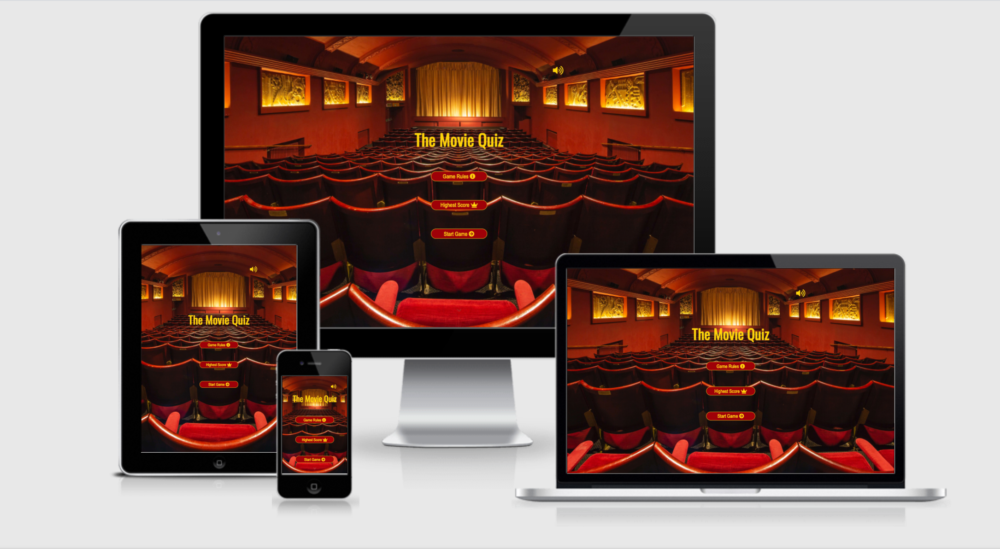

# **CI-MS2-MovieQuiz**

Interactive Front-End Development Project using HTML, CSS and Javascript

A live website can be found [here](https://melindazhang2020.github.io/CI-MS2-MovieQuiz/).

## **Table of Contents**

- [About](#About)
- [Users Experience(UX)](<#users-experience(ux)>)
  - [Project Goals](#project-goals)
  - [Target Audience](#target-audience)
  - [User Stories](#user-stories)
  - [Design](#design)
  - [Wireframe](#wireframe)
- [Features](#Features)
  - [Existing Features](#existing-features)
  - [Features Left to Implement](#features-left-to-implement)
- [Technologies-Used](#Technologies-Used)
- [Testing](#Testing)
- [Deployment](#Deployment)
- [Credit](#Credit)
  - [Content](#content)
  - [Media](#media)
  - [Acknowledgements](#acknowledgements)

## **About**

Who doesn't like a good old quiz?! Quiz is a fun way to spend your time when you are bored, you are not only entertained but also gained knowledge along the way!

Do you think you love watching movie and have watched a lot of movies in the past, that you consider yourself as a movie buff? Take a few minutes complete the quiz, you will find out if that is true!

This Movie Quiz is designed to include a wide range of questions about all types of movies. From the old to the new, from cartoon to fantasy, any movie you can think of, it's made of 125 questions, each game has 10 questions, each correct question gains 10 points, so you can keep playing and aim for that 100 points each time! Have fun!

## **Users Experience (UX)**

### **Project Goals**

- The primary goal of this project is to set up a form of game or mind sport for the players that may become a brief assessment for the user to measure the knowledge in films.

- The secondary goal is to help the user get their thinking mind on. According to studies, brain games may help sharpen certain thinking skills that tend to wane with age, such as processing speed, planning skills, reaction time, decision making, and short-term memory.

### **Target Audience**

- Considering the format of the quiz for this project, as there won't be pictures displayed in the question, our target audience will be over 16 year old.

- In today's world, everything is international, and that includes the film industry, most of the popular movies are known by majority people of the wrold, considering that, our target audience's location is global.

- As there's no evidence shows that man loves watching moive more than woman or vice versa (even though I hear a lot from my female friends that their men watches the same movie over and over!), our target audience will be both genders.

- The best way to promote our quiz game is through online advertisements and social media shares.

### **Uers Stories**

- **General User Goals**

  - As a movie lover, I want to find movie related activities, so that it broads up to my entertainments options.

  - As a movie buff, I want to find a quiz, so that I can test my knowledge level about movies.

  - As a gamer, I want to find interesting games, so that I can spend time enjoying playing it.

  - As an explorer , I want to explore through games, so that I can found intereting ideas and topics.

  - As a competitive person, I want to find a competitive game, so that I can challenge myself.

  - As a music lover, I want to listening to music while I'm answering the questions, so that I get both visual and hearing stimulation.

  - As a goal achiever, I want to save the scores, so that I can drive to go pass that score each time when I play.

  - As a mobile user, I want an application is molibe friendly, so that I can use it on my mobile.

- **First Time Visitor Goals**

  - As a First Time Visitor, I want to easily understand the main purpose of the site and learn more about how to play the game.

  - As a First Time Visitor, I want to be able to easily navigate throughout the site to give the game a try.

  - As a First Time Visitor, I want to know about the developer infomation and their social media links.

- **Returning Visitor Goals**

  - As a Returning Visitor, I want to find the leader board and beat my last score.

  - As a Returning Visitor, I want to see if there are higher scores saved in the system so I can try to beat it.

### **Design**

- Colour Scheme

  The two main colours used are red and yellow, you can find a copy of the colour palette [here](assets/documentation/MS2-color-palette.pdf)

- Typography

  - Franklin Gothic Medium is the main font used throughout the whole website for main text and buttons, with Arial Narrow, Arial, sans-serif as the fallback font in case of any reason the font isn't being imported into the site correctly. Franklin Gothic is an common font and it suits the scheme and makes the website appealing.

  - The headline font is Oswal by google font with sans-serif as the fallback font. It fits in the feel of the site perfectly.

- Imagery

  - Imagery is very important. The background hero image is designed to grab user's attention and give the users the feeling as if they are in a cinema.

  - The end game illustrations demonstrate to the user how they did, gives immediate feed back, not only appealing but also encouraging.

### **Wireframes**

[Desktop wireframe](assets/documentation/MS2-MovieQuiz-desktop.pdf)

[Tablet wireframe](assets/documentation/MS2-MovieQuiz-Tablet.pdf)

[Mobile wireframe](assets/documentation/MS2-MovieQuiz-Mobile.pdf)

## **Features**

### **Existing Features**

- Homepage navigation - consists three main buttons which allows users to read the rules of the game, check on the highest Score the other players did so far and start the game when they are ready.

- Music on and off switch - which allows the users to switch on the music if they would like to.

- clickable footer contains copyright and developer social media links.

- Progress text - shows how many questiones the user have finished on and how many questions left in the game.

- Progress bar - indicates the percentage of the questions have been done out the game at this particular moment.

- Score updates - tells the user how many points the have gain so far in the game.

- Display question section - allow the users to see the displayed question and participate.

- Multiple-choice section - gives the users four choices they can choose from.

- Right(green) or Wrong answer(red) - indicate the users if they have selected the right or wrong answer.

- Right/wrong answer audio gives the users the 2D user experience.

- Options to switch off the sound effect and go back to the home page at any stage of the game.

- Automaticly direct the user to the end page when the game is finished and shows the final score.

- Displaying an end image and audio depending on the score achieved.

- A mute music button is also avaliable in the end page.

- End page navigation - consist with three main buttons which allows the users to save their name and score, play again or go back to the homepage.

- High Score indication bar - tells the users how many points in total they have gained.

- Username Input field - gives the users the options to enter their name and save their score in the local storage.

- The save button is only clickable when there is an input value in the input field.

### **Features Left to Implement**

- Displaying relative images in each questions to enhance users visual experience.

- Playing different audio for different score scenarios.

- Only one sound button need to be clicked throughout all pages.

## **Technologies Used**

### Languages Used

- [HTML5](https://en.wikipedia.org/wiki/HTML#:~:text=The%20HyperText%20Markup%20Language%2C%20or,displayed%20in%20a%20web%20browser.)

  - The language used to give the site its main structure and all necessary features.

- [CSS3](https://en.wikipedia.org/wiki/CSS)

  - The language used to give the application its visual effects including the font, color and layout etc.

- [Javascript](https://developer.mozilla.org/en-US/docs/Web/JavaScript)

  - The language used to implement the site's interactive features, allow the users to be interactive and make actions during their visit.

### Frameworks, Libraries & Programs Used

- [VScode](https://code.visualstudio.com/)

  - Visual Studio Code has been used as a local code editor for write and manage all codes and files.

- [Github](https://github.com/)

  - Github is used to create, store and maintain all codes in a repository.

  - Github is also used as the site hosting service for the final website to be published on.

- [Git Version control](https://git-scm.com/)

  - Git 2.31.1 for Mac is used for commit and push codes to Github.

- [Google Fonts](https://fonts.google.com/)

  - The font used on this quiz were chosen from Google fonts.

- [Fontawesome](https://fontawesome.com/)

  - The icons used on this quiz were found in Fontawesome.

- [Balsamiq](https://balsamiq.com/)

  - The wireframes were created using Balsamiq.

- [Google DevTools](https://developer.chrome.com/docs/devtools/)

  - Google DevTools was extensively used throughout the project for various styling, testing and debugging purposes.

- [Am I Responsive](http://ami.responsivedesign.is/)

  - Am I responsive has been used to test the responsiveness of the site and also to create the mock-up image presented at the start of this document.

- [W3C Markup Validation service](https://validator.w3.org/)

  - W3C Markup Validation Service has been used to test the HTML codes.

- [W3C CSS Validation Service](https://jigsaw.w3.org/css-validator/)

  - W3C CSS Validation Service has been used to test the CSS codes.

- [tinypng.com](https://tinypng.com/)

  - tinypng.com has been used to compress large images.

- [coolors](https://coolors.co/)

  - coolors has been used to decide the color scheme for the site.

- [Open Trivia Database](https://opentdb.com/api_config.php)

  - Open Trivia Database has been used to get the main questions for the quiz.

## **Testing**

Testing information can be found in a seperate file [testing.md](testing.md)

## **Deployment**

### **Deploy To GitHub Pages**

1. Logged into Github account.

2. Select repository.

3. Select CI-MS2_MovieQuiz.

4. On the top right navigation click on settings.

5. Under the settings section, scroll down to the GitHub Pages section.

6. Select Main Branch from the source dropdown menu.

7. Click save.

8. Once clicked, this publishes the project to GitHub Pages and displays the site URL. Click on the URL to view the live site.

### **Making a clone or download zip to run locally**

1. Log into GitHub account.

2. Select repository.

3. Select CI-MS2_MovieQuiz.

4. Click on the Code dropdown button next to the green Gitpod button.

5. Click on the clipboard icon to copy the clone URL.

6. Open Git Bash.

7. Change the current working directory to the location where you want the cloned directory.

8. Type "git clone" in the Command Line and then paste the URL copied in step 5.

9. Press enter to create your local clone.

10. Alternately, click on Download ZIP, unpack locally and open with a local code editor.

### **Forking the GitHub Repository**

1. Log into GitHub.

2. Select repository.

3. Select CI-MS2_MovieQuiz.

4. At the very top right corner click "fork".

5. You will have a copy of the original repository in your own GitHub account.

## **Credits**

### **Content**

Throughout the process of doing this project I have done a lot of searching and learning. The codes that are copied and pasted have been marked as a comment in the relevant files. All the rest of the codes are written by myself after learning from resources. The resources and the links I used to learn each concepts are the following:

- Codes

  - [w3schools](https://www.w3schools.com/) - [audio](https://www.w3schools.com/html/html5_audio.asp), [javascript modal](https://www.w3schools.com/howto/howto_css_modals.asp), [loader](https://www.w3schools.com/howto/howto_css_loader.asp), [cubic-bezier](https://www.w3schools.com/cssref/func_cubic-bezier.asp), [javascript objects](https://www.w3schools.com/js/js_objects.asp), [setInterval and clearInterval](https://www.w3schools.com/jsref/met_win_setinterval.asp), [setTimeout](https://www.w3schools.com/js/js_timing.asp), [Array splice](https://www.w3schools.com/jsref/jsref_splice.asp), [DOM changing CSS](https://www.w3schools.com/js/js_htmldom_css.asp), [JSON.parse()](https://www.w3schools.com/js/js_json_parse.asp), [Math.floor()](https://www.w3schools.com/jsref/jsref_floor.asp), [CSS background-image](https://www.w3schools.com/cssref/pr_background-image.asp), [CSS box-shadow](https://www.w3schools.com/cssref/css3_pr_box-shadow.asp), [Array map()](https://www.w3schools.com/jsref/jsref_map.asp)

  - [stackoverflow](https://stackoverflow.com/) - [display options randomly](https://stackoverflow.com/questions/53362187/javascript-quiz-display-random-options), [difference between innerText and innerHTML](https://stackoverflow.com/questions/19030742/difference-between-innertext-innerhtml-and-value), [convert an object key value into an array](https://stackoverflow.com/questions/38824349/how-to-convert-an-object-to-an-array-of-key-value-pairs-in-javascript)

  - [MDN Web Docs](https://developer.mozilla.org/en-US/docs/Web/JavaScript/Reference/Global_Objects/Math/max) - [Math.max()](https://developer.mozilla.org/en-US/docs/Web/JavaScript/Reference/Global_Objects/Math/max), [window.location.assign()](https://developer.mozilla.org/en-US/docs/Web/API/Location/assign), [window.localStorage](https://developer.mozilla.org/en-US/docs/Web/API/Window/localStorage), [Array.prototype.join()](https://developer.mozilla.org/en-US/docs/Web/JavaScript/Reference/Global_Objects/Array/join), [Element.classList](https://developer.mozilla.org/en-US/docs/Web/API/Element/classList), [parseInt()](https://developer.mozilla.org/en-US/docs/Web/JavaScript/Reference/Global_Objects/parseInt), [Spread syntax](https://developer.mozilla.org/en-US/docs/Web/JavaScript/Reference/Operators/Spread_syntax), [forEach](https://developer.mozilla.org/en-US/docs/Web/JavaScript/Reference/Global_Objects/Array/forEach), [Fetch API](https://developer.mozilla.org/en-US/docs/Web/API/Fetch_API)

  - Youtube Videos

    - [James Q Quick's Quiz App video](https://www.youtube.com/playlist?list=PLDlWc9AfQBfZIkdVaOQXi1tizJeNJipEx)

    - [Dani Krossing's favicon video](https://www.youtube.com/watch?v=kEf1xSwX5D8)

    - [Muhanad Hasan's timer video](https://www.youtube.com/watch?v=9-5URe9CykA&t=113s)

  - For creating the bouncing arrow on the front page from [codepen](https://codepen.io/lloopp/pen/XWJKMNr)

  - [7 Methods for Comparing Arrays in JavaScript](https://javascript.plainenglish.io/7-methods-for-comparing-arrays-in-javascript-88f10c071897)

- User Experience

  - [How To Define Your Target Audience in 6 Quick Questions](https://exposureninja.com/blog/define-your-target-audience/)

  - [How to write a good user story](https://stormotion.io/blog/how-to-write-a-good-user-story-with-examples-templates/#.YFM57o-2eQY.linkedin)

### **Media**

- Images

  - Front page background image is downloaded from [unsplash](https://unsplash.com/).

  - The end page images is downloaded from [icons8](https://icons8.com/).

  - The favion displayed on top of the page in the tab area is made with [favicon.io](https://favicon.io/).

- Audio

  - The front page audio "sweet surrender" and the right/wrong answer ausio are downloaded using [WavePad](https://www.nch.com.au/wavepad/index.html?ns=true&kw=wavepad&gclid=Cj0KCQjwgtWDBhDZARIsADEKwgPKSGQMHu1oU7mhDP6HxH6ReUbm5iOsK_8w5u3KuxMPnmI2Z4XYqBwaAsfNEALw_wcB)

  - The end page congrats audio is downloaded from [Chosic](https://www.chosic.com/)

### **Acknowledgements**

I would like to thank:

- My mentor Antonio Rodriguez for his encouragement and patience when my frustration kiched in at the start of this project. Thanks to his guidence and tips, I have gotten over the dip and made it to the end.

- Help and support from fellow students in the Slack community.

- Tutor support and student care team.

- My boyfriend Kevin Hurley's support and help with testing and encouragement.

Should you have any queries please reach me on melinda_hongye@yahoo.com
