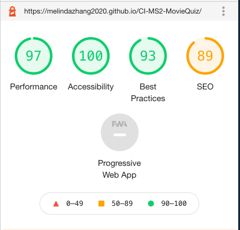
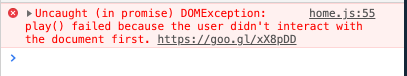

# CI-MS2-MovieQuiz Testing Documentation

## Table of Contents

- [User Stories Testing](#user-story-testing)

- [Validators](#validators)

- [Features Testing](#features-testing)

  - [Home Page](#home-page)

  - [Game Page](#game-page)

  - [End Page](#end-page)

  - [High Scores Page](#high-scores-page)

- [Site Responsiveness](site-responsiveness)

- [Further Testing](#further-testing)

- [Bugs and Issues](#bugs-and-issues)

## User Stories Testing

- **General User Goals**

  - As a user, I would like to use other senses rather than just sight, it gives me a better experience. Movie Quiz uses aduio throughout the site, background music option on the home page, right/wrong answer sound effect on the game page, and congratulation music when the game ends.

  - As a user, the color contrast is critical to me, I want to be able to read the content on the page. Movie Quiz used yellow over dark red color theme, it's easy to read and also easy on the eyes.

  - As a user, when I play a quiz game, I expect the format of questions to be well set up. Movie Quiz game page consists of a question heading area indicating how far the user is in the game, a progress bar for visual effect, and updated scores tells how many points they have made so far.

  - As a user, sometimes I could get annoyed by the music/sound so I want to have the option to switch it off anytime. Throughout all pages when there's sound/music, a button is provided to switch it off anytime.

  - As a user, I expect quiz game to a bit challenging. Movie Quiz has a timer installed in the game that only gives the user 60 seconds to select an answer.

  - As a mobile user, I want to play the game on my mobile. The site is fully responsive and can also be played on a mobile or a tablet.

- **First Time Visitor Goals**

  - As a First Time Visitor, when I enter a website I want to see a clear visual set up, images and buttons and a minimum amount of text on the front page. Movie Quiz used a full screen background image and head line and 3 buttons as its main feature on the front page. The visual effect is clear and simple.

  - As a First Time Visitor, I want to quit the game anytime if I decided to. The game page has a option of going back to the home page anytime.

  - As a First Time Visitor, images and music are a better experience than plain text. The game finishes with a congratulations music that auto plays and an image with encouraging words.

  - As a First Time Visitor, I need to know where is clickable, and which choice is my mouse on. Moive Quiz choices have a hover over effect, the choice scales bigger, the border changes color and a box shadow appears whenever the mouse is hovered over the choice.

  - As a First Time Visitor, I need to know if my answer is right or wrong. Movie Quiz has implemented that need by visual and sound effect. The choice changes to green color if the answer is correct, and red if the answer is incorrect. A dedicated sound is also assigned to both scenarios.

  - As a First Time Visitor, when I finish the game, I would like to know my final scores. The game automatically goes to the end page when a game is finished and a final score displays.

  - As a First Time Visitor, I want to save my name and my high scores. The end page gives the user the option of saving their names and score in the local storage when a new high score is achieved.

  - As a First Time Visitor, I would like the option to play again, if I found the game interesting and want to do better in the next round. The end page has a button of playing the game again or go home.

  - As a First Time Visitor, I would like to check the scores leader board. In the home page, there is a button to check the high scores list of top 5.

  - As a First Time Visitor, it will be nice to know the developer info. The clickable footer provide this option with the name and social link of the developer.

  - As a First Time Visitor, I want to identify the website easily and if I choose to bookmark the page, it will be visiable in my bookmarks folder. The favicon serves that purpose perfectly.

- **Returning Visitor Goals**

  - As a Returning Visitor, I want to check the leader board to see if there is high scores for me to beat. The high Scores page serves that purpose.

  - As a Returning Visitor, I want to find my last score, the save option serves that purpose well.

## Validators

The W3C Markup Validator and The W3C CSS Validator were used to validate every page of the project to ensure there were no syntax errors.

- W3C Markup Validator results

  [Home Page](assets/docomentation/html-home.png)

  [Game Page](assets/docomentation/html-game.png)

  [End Page](assets/docomentation/html-end.png)

  [High Scores Page](assets/docomentation/html-highScore.png)

- W3C CSS Validator results

  [Home Page](assets/docomentation/css-home.png)

  [Game Page](assets/docomentation/css-game.png)

  [End Page](assets/docomentation/css-end.png)

  [High Scores Page](assets/docomentation/css-highscore.png)

## Features Testing

### Home Page

- Navigation Buttons

  Tested all three buttons to make sure they are linked correctly and direct to the correct page. Checked the hover effect works when the mouse hovers over, so that the buttons scale bigger in size and box shadow drops.

- Game Rules Modal

  Made sure the game rules modal opens and closes as expected, and that clicking on the X or anywhere else on the page closes the modal.

- Music On/Off Button

  Tested that the music On/Off button toggles when you click and the music is turned on and off accordingly.

- Footer Arrow

  Tested the footer arrow is clickable, and it toggles the footer between shown and hidden.

- Footer

  Made sure when the footer shows it doesn't add to the viewport and the height stays the same.

- Footer Social Links

  Check all icons are clickable,changes color when hover and linked to relevant pages. Also opens up a new page.

### Game Page

- Loader

  Tested the loader shows up when the speed of loading is slow, and displayed as expected.

- Question Number Display

  Checked question number is displayed for each question in each game.

- Question Progress Bar

  Checked the question progress bar is updating as each question has been answered, and shows the correct percentage of completed questions.

- Score Title

  Checked the score title displayed.

- Score Display Update

  Made sure the scores update when an answer is correct, and adds up 10 points each time.

- Main Question Display

  Checked the main question is displayed correctly and randomly with no errors etc by playing the game numerious times.

- Choices Display

  Checked the choices of each question are displayed correctly without any errors. And made sure the correct answer is displayed in a random place.

- Timer Display

  Check the timer is displayed in the correct format and the icon shows up in the correct style.

- Timer decrement

  Made sure the timer decrease by 1 every second, and goes back to 59 when the next question starts.

- Sound On/Off Button

  Checked the sound on/off button is working, it turns the sound on/off.

- Go Home Button

  Made sure the go home button directs the user to the home page.

- Right/Wrong Answer indication (color)

  Checked the choice turns to green when the answer is the correct answer and red when the answer is a wrong answer.

- Right/Wrong Answer indication (sound)

  Checked the sound is playing accordingly when the question been answered.

- No Repeating Questions in the round

  Double checked there is no repeated question showing up in the same round by playing the game and console log all 10 questions.

- Move to the next question automaticly

  Made sure the next question is displayed after the user clicked on an answer.

- Move to the next question when the timer is up

  Made sure after the timer is up the next question is displayed.

### End Page

- Final Score Display

  Checked a final score is displayed clearly.

- Music Auto Play

  Congrats music is automatically played when the game is finished.

- Music On/off Button

  Tested the music on/off button is working.

- Congrats Images

  Tested the congrats images are showing up in the right style and position.

- Congrats Images show up depending on the scenarios

  Checked images are showing accordingly to the different scenarios by playing the game and changed the most recent score in the local storage.

- Username Input

  Tested if the user can type in the input field.

- Save Button

  - Save name and Score in local storage

    Tested if the name and score are saved in the local storage by checking the local storage in application in developer Devtool.

  - Only allow save when a value entered

    Made sure the button is disabled if no value in the input field.

- Play Again Button

  Made sure the play again button directs to the game page and the questions are displayed correctly from the start.

- Go Home Button

  Checked the go home button is working and linked to the home page.

### High Scores Page

- High Scores Title

  Checked the high score title is displayed with an icon following.

- Leader Board

  Checked a leader board is displayed when users save their names and scores.
  And it shows the top 5.

- Leader Board Scale When Hovered Over

  Checked each name and scores scale bigger in size when hovered over.

- Go Home Button

  Checked the go home button worked and linked to the home page.

## Site Responsiveness

- Tested in Google Devtool by switching on the mobile view for different screen sizes, and by reducing the broswer window sizes.

- Tested by opening up the website on different devices.

- Test on Google Extensions [Responsive Viewer](https://chrome.google.com/webstore/detail/responsive-viewer/inmopeiepgfljkpkidclfgbgbmfcennb?hl=en)

  The screenshots are the following:

  [Home Page](assets/documentation/homepage.png)

  [Game Page](assets/documentation/gamepage.png)

  [End Page](assets/documentation/endpage.png)

  [High Scores](assets/documentation/highscore.png)

## Further Testing

- The website was tested on a variety of devices:

  - MacBook Air

  - Dell laptop

  - Sumsung Galaxy tab A10.1

  - Sumsung Galaxy S10

  - Huawei P10

  - Sumsung A125F

  - Iphone 5

- The website was viewed by different browsers:

  - Google Chrome

  - Mozilla Firefox

  - Opera

  - Microsoft Edge

  - Safari

- A large amount of testing was done to ensure that all pages were linking correctly.

- Friends and family members were asked to review the site and documentation to point out any bugs and/or user experience issues.

- Futhermore, I have done testing with Google Devtool light house and the result is shown below:

  

## Bugs and Issues

- The home page background music doesn't autoplay on first entering the page and an error shows in console as seen below:

  

  I did some research and found out autoplay didn't work due to [autoplay policy](https://developers.google.com/web/updates/2017/09/autoplay-policy-changes)

  I fixed this problem by switching the on and off button around, so the user can turn the music on if they wanted to.

- When tested on Sumsung Galaxy S10, after the user clicks on an answer the hover effect stays on that choice even after the next question is displayed.

  This issue remained unfixed for further researching and learning.
